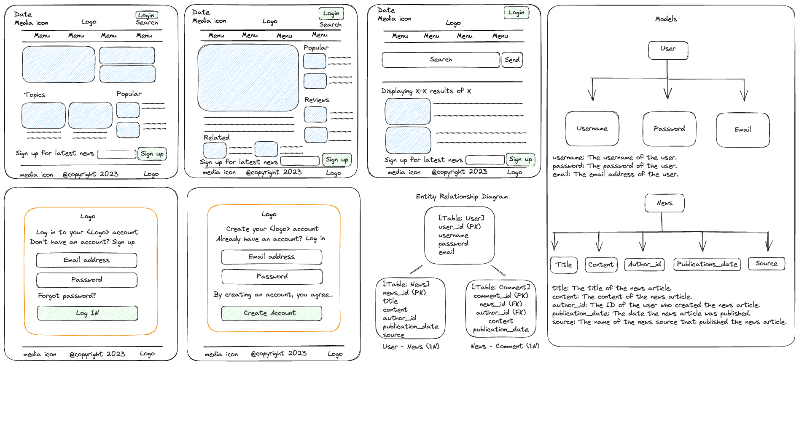

# News Time 
This is a README file for the News App, a web application that allows users to browse and read news articles from a variety of sources. The app provides features such as article browsing, full-text reading, saving articles for later, and sharing articles with friends.

## Technology Used

- HTML
- CSS
- JavaScript: EJS, Express, NodeJS

## How To Install

## User Stories
The following user stories have been identified for the News App:

1. As a user, I want to be able to browse a list of news articles from different sources.
2. As a user, I want to be able to read the full text of news articles.
3. As a user, I want to be able to save news articles to read later.
4. As a user, I want to be able to share news articles with my friends.

## APIs
The News App utilizes the following APIs:

- News API from Google: This API allows the app to retrieve news articles from various sources.

## Wireframes & ERD (Entity-Relationship Diagram)
Wireframes for the News App have been created to visualize the app's design and layout. The ERD (Entity-Relationship Diagram) for the News App can be found in the wireframes as well. 

## Working App Images 

## Fundamentals
Here are some key aspects and requirements of the News App:

1. Deployment: The app is deployed on ______.
2. Basic Functionality: The app implements essential functionality related to its goal.
3. Routes: The app includes at least 10 GET routes (excluding authentication), 3 POST routes, 3 DELETE routes, and 3 PUT routes.

Difficulty: The app utilizes the News API from Google and implements advanced database relationships.

## Future Enhancement