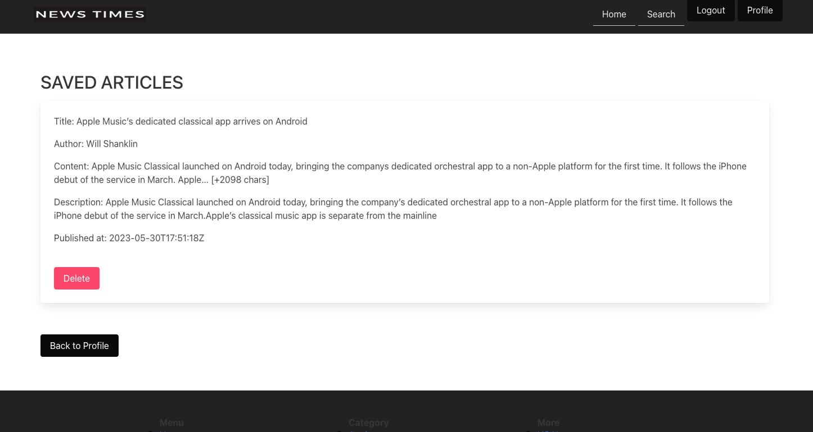
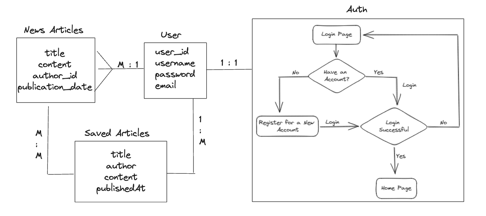

# Stay Up to Date with the Latest News!

In today's fast-paced world, staying informed is crucial. Don't miss out on important updates and breaking news that could impact your life and business. With our comprehensive coverage of local and global news, you'll have access to a wide range of topics, including politics, business, technology, entertainment, and more.

News Times is a web application that allows users to browse and read news articles from a variety of sources. The app provides features such as article browsing, full-text reading, and saving articles for later. The app implements essential functionality related to its goal. The app includes a GET, POST, DELETE, and PUT routes. The app utilizes the News API from Google and implements advanced database relationships.

The app is deployed on ______.

# Languages, Frameworks, & Libraries Used:


# How To Install
Setup requirements: 
`Node.js`, `Postgres`, `Sequelize` 

1. `Fork` and `Clone` this respository to your local machine
2. Run `npm install` to install dependencies.
3. Run `npm run dev` or `npm start` to start server.
4. Open `http://localhost:3000` the web browser. 

To access and view database: 
Run `sequelize db:migrate:all` and sequelize `db:seed:all` to setup database.

# How To Use

1. You can `view` daily update News Articles from NewsAPI 
2. Create an account by `signing up` or `login`
3. Once `logged in`, you can `edit` your `profile` 
4. Read and `save` your `articles` to `profile`

# Working App Images 

### Sign Up Page 


### Login Page 


### Home Page 


### Articles Page 


### Single Article Page 


### User Profile Page 


### Saved Article Page 



### User Profile Edit Page 


### Moblie View


# HOW IT WORKS
The app utilizes the News API from Google and implements advanced database relationships.
The following user stories have been identified for the News App:

1. User able to browse a list of news articles from different sources.
2. User able to read the full text of news articles.
3. User able to save news articles to read later.

## API CALLS

The code snippet provided is a 1 out of 10 GET route handler function that handles the `/apple` route. 
```
app.get('/apple', function (req, res) {
  axios.get('https://newsapi.org/v2/everything?q=apple&apiKey=' + apiKey)
    .then(function (response) {
      // handle success
      if (response.status === 200) {
        res.render('apple', { articles: response.data.articles });
      } else if (response.status === 404) {
        res.json({ message: 'No articles found.' });
      } else if (response.status === 401) {
        res.json({ message: 'Invalid API key.' });
      } else if (response.status === 504) {
        res.json({ message: 'Request timed out.' });
      }
    })
    .catch(function (error) {
      res.json({ message: error.message });
    });
});
```
 This code sends a request to the News API to fetch articles related to `apple`. Depending on the response status, it renders the retrieved articles in the `apple` view template, or sends JSON responses with specific error messages if there are issues with the request or response.

## Add Saved Articles 

The code snippet provided is a router POST handler function that handles the /add route.
```
router.post('/add', isLoggedIn, async (req, res) => {
    try {
        // Retrieve the article data from the request body
        console.log("console---------> ", req.body);
        const { title, content } = req.body;

        // Save the article to the database or any other data source
        await article.create({
            author: req.body.author,
            title: req.body.title,
            content: req.body.content.slice(0, 250),
            description: req.body.description.slice(0, 250),
            publishedAt: req.body.publishedAt,
        });

        // Redirect back to the saved articles page
        res.redirect('/savedArticles');
    } catch (error) {
        console.error(error);
        res.status(500).send('Internal Server Error');
    }
});
```
It is a protected route `isLoggedIn middleware` is used that requires authentication to access. The function receives the HTTP request `req` and response `res` objects as parameters. The article data is then saved to a database or any other data source using an `article` model. The `create` method is called on the `article` model with the extracted data and additional processing on `content` and `description `fields (slicing the content to 250 characters). If the article is successfully saved, the server redirects the user back to the `/savedArticles `page. If an error occurs during the process, it is `caught` in the catch block, and an error message is logged to the console. The server responds with a status code of 500 `Internal Server Error` and sends an error message as the response body.

## Delete User Profile 

### ppConfig.js: 
The code defines a LocalStrategy for Passport authentication that checks if the provided email corresponds to a user in the database, validates the password, and verifies if the user is active.
```
if (!foundUser || !foundUser.validPassword(password) || foundUser.active === false) {
    cb(null, false);     // if no user or invalid password, return false
} 
```
If no user is found or the password is invalid, or if the user is not active, the callback is called with `null` as the first argument and `false` as the second argument, indicating unsuccessful authentication.

### Profile.js: 
This code snippet updates a user's profile by setting the `active` property to `false` and logs the user out. It then sets a flash message indicating that the account does not exist and redirects the user to the root URL. If any errors occur during the process, an appropriate error response is sent.
```
router.put('/:id', isLoggedIn, async (req, res) => {
    const putUserProfile = { ...req.user };

    putUserProfile.active = false;

    user.update(putUserProfile, {
        where: { id: req.params.id }

    })
        .then(() => {
            req.logOut(function (err, next) {
                if (err) { return next(err); }
                req.flash('success', 'Account does not exist. Please sign up!');
                res.redirect('/');
            });
        })
        .catch((error) => {
            res.status(500).send('Internal Server Error');
        });
});
```

### PostgresSQL: 
The provided PostgreSQL table displays user information, including their ID, name, email, password, active status, creation date, and update date.
```
 id |   name    |      email      |                           password                           | active |         createdAt          |         updatedAt
----+-----------+-----------------+--------------------------------------------------------------+--------+----------------------------+----------------------------
  2 | Peter Pan | user5@gmail.com | $2a$12$U9tA1sjxCpzJ1Vl2BnBwqe9uhBMxKTLm7OKPOis1WCDEejlvO5aDK | f      | 2023-06-06 20:27:55.067-07 | 2023-06-06 21:24:46.438-07
  1 | test6     | user4@gmail.com | $2a$12$hi//QViF/bEzxalf1iy43eidPUeyG68.PKYA7vdKx.T4eIl2PkcEq | f      | 2023-06-06 20:03:09.639-07 | 2023-06-06 21:26:19.725-07
  3 | user7     | user7@gmail.com | $2a$12$1xHhF7ScX87P15d7pc0eVepAtp51ZdInBtI4ugzhVfoCoYM.5IPn. | t      | 2023-06-06 21:26:47.972-07 | 2023-06-06 21:26:47.972-07
  4 | spiderman | user8@gmail.com | $2a$12$9LUMkndM0tfLqIZyQQHpv.hPyyoBewLosvRRgG5GwRlSFXHpM7eQm | f      | 2023-06-06 22:23:40.956-07 | 2023-06-06 22:23:52.074-07
(4 rows)
```
When displaying user information, if a user is marked as 'active,' it means their account is active and they can log in. However, if a user is marked as 'false,' it indicates that they have deleted their account and can no longer log in. In such cases, they will need to create a new user account.

# Entity Relationship Diagram 



# Models 


# Initial Wireframes
Wireframes for the News App have been created to visualize the app's design and layout. The ERD (Entity-Relationship Diagram) for the News App can be found in the wireframes as well. 


# Future Enhancement
- Update bio form & add functionality for upload images
- Recraft model to show images and url link in saved list 
- Share with friends 
- Add Hamburger Menu
- Restyle to articles layout with limited articles per page  
- Update footer 

# ATTRIBUTION
News Api: https://newsapi.org/

Tools use to create logo: https://www.canva.com/

# LICENSE 

The source code for the site is licensed under the MIT license, which you can find in the MIT-LICENSE.txt file.

[](https://opensource.org/licenses/MIT)